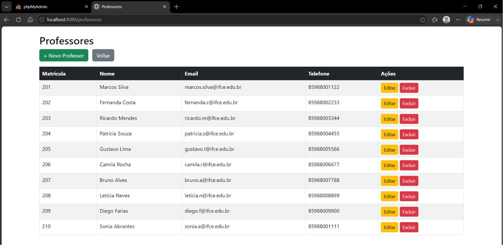
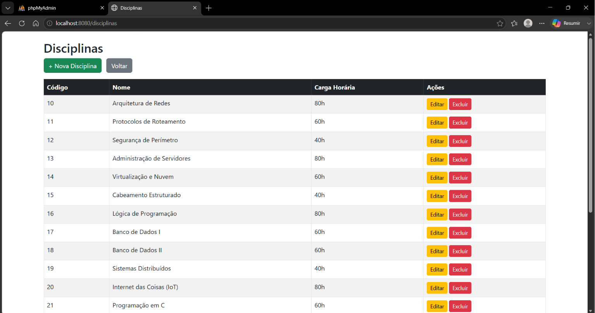
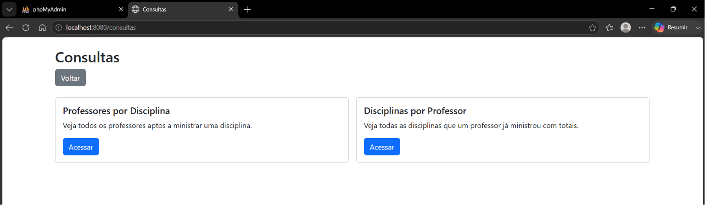

# 🏫 Sistema Web de Gestão de Competências Acadêmicas 

Este projeto é um Sistema Web unificado desenvolvido em **Spring Boot (Java)** para a gestão de competências acadêmicas, relacionando professores, disciplinas e o histórico de turmas ministradas no departamento.

## 🛠️ Tecnologias Utilizadas
* **Backend:** Java 17 / Spring Boot 3.2.5 / Spring Data JPA
* **Banco de Dados:** MySQL (via phpMyAdmin)
* **Frontend:** HTML5 / Thymeleaf / Bootstrap 5
* **Gerenciador de Projeto:** Apache Maven

---

## 📸 Demonstração do Sistema

### 👥 Gerenciamento de Professores
Lista os docentes cadastrados e permite a inserção e edição de perfis acadêmicos.

### 📚 Gerenciamento de Disciplinas
Módulo focado no controle de componentes curriculares e cargas horárias totais.

### 🔍 Aba de Consultas Avançadas
Centraliza as buscas por professores aptos por componente curricular e o histórico didático de turmas ministradas.

